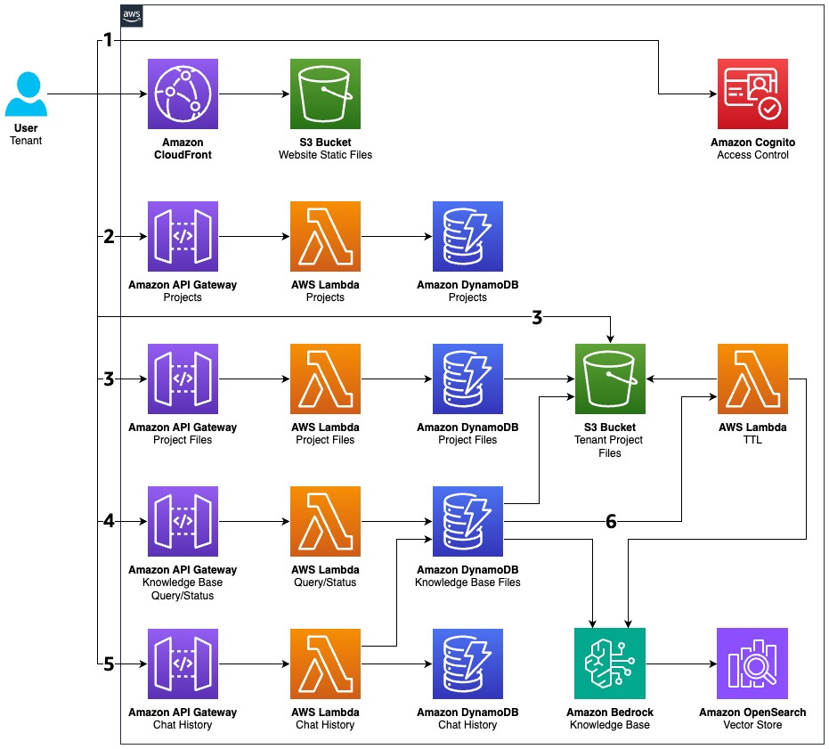

# Sample Just-In-Time Knowledge Base

This sample project demonstrates a just-in-time knowledge base implementation using Amazon Bedrock and Amazon OpenSearch Serverless. The application allows users to upload documents, organize them into projects, and query them using natural language through a chat interface.

## Project Structure

The project is organized into two main sections:

1. **Website**: A React-based frontend application
2. **Infrastructure**: AWS CDK code for deploying all required resources

## Features

- Multi-tenant architecture with configurable limits per tenant
- Document upload and management organized by projects
- Just-in-time knowledge base integration with Amazon Bedrock
- Automatic document expiration using TTL
- Chat interface for querying documents with natural language
- Authentication and authorization using Amazon Cognito

## Prerequisites

- Node.js (v18 or later)
- AWS CLI configured with appropriate permissions
- AWS CDK installed globally (`npm install -g aws-cdk`)

## Setup and Deployment

### 1. Install Dependencies

Install all dependencies for the project:

```bash
npm run install:all
```

This command installs dependencies for:
- The root project
- The infrastructure code
- The website frontend

### 2. Build the Project

Build both the website and infrastructure:

```bash
npm run build
```

This command:
- Builds the React website (`npm run build:web`)
- Synthesizes the CDK stack (`npm run build:infra`)

### 3. Deploy to AWS

Deploy the application to AWS:

```bash
npm run deploy
```

For local development with localhost support:

```bash
npm run deploy:local
```

The `deploy:local` command adds CORS support for localhost:8000, allowing you to run the website locally while connecting to AWS resources.

### 4. Configure Local Development

After deployment, download the configuration file for local development:

```bash
# The exact command will be output after deployment
aws s3 cp s3://<website-bucket-name>/config.js ./website/config.js --region <region>
```

This command downloads the auto-generated `config.js` file containing all necessary configuration values (Cognito User Pool ID, API Gateway URL, etc.) for the frontend.

## Local Development

Run the website locally:

```bash
npm run dev
```

This starts the Vite development server at http://localhost:8000.

## Testing

Run the infrastructure tests:

```bash
npm test
```

This runs Jest tests to verify that the CDK stack creates the expected resources and configurations. The tests validate:

- Core AWS resources (Cognito, S3, DynamoDB, Lambda, API Gateway, CloudFront)
- OpenSearch and Bedrock Knowledge Base resources
- CORS settings for localhost when enabled

## Project Components

### Website (React + Vite)

The website provides a user interface for:
- User authentication
- Project management
- Document upload and management
- Chat interface for querying the knowledge base

Key technologies:
- React 18
- Material UI 7
- React Router
- Amazon Cognito for authentication
- AWS SDK for JavaScript

### Infrastructure (AWS CDK)

The infrastructure code deploys:

- **Amazon Cognito**: User authentication and authorization
- **Amazon S3**: Storage for user files and website hosting
- **Amazon DynamoDB**: Tables for projects, files, and chat history
- **Amazon OpenSearch Serverless**: Vector store for the knowledge base
- **Amazon Bedrock**: AI model access for embeddings and retrieval
- **AWS Lambda**: Backend functions for API implementation
- **Amazon API Gateway**: RESTful API endpoints
- **Amazon CloudFront**: Content delivery for the website

## Lambda Functions

- **ProjectsFunction**: Manages project creation and retrieval
- **ProjectFilesFunction**: Handles file uploads and management
- **QueryKnowledgeBaseFunction**: Processes queries against the knowledge base
- **CheckKnowledgeBaseStatusFunction**: Checks ingestion status
- **CleanupKnowledgeBaseFunction**: Removes expired documents

## Architecture

The application uses a serverless architecture with:
- Vector embeddings stored in OpenSearch Serverless
- Just-in-time document ingestion into the knowledge base
- Automatic document expiration using DynamoDB TTL
- Multi-tenant isolation with configurable limits



### Architecture Flow

1. User logs into the system which attaches a tenant ID to the current user for all calls to the Amazon Bedrock Knowledge Base.
2. User creates a project which serves as a container for all the files they want to query.
3. User uploads files which are stored in S3 with entries in DynamoDB that associate each file with both the project and tenant.
4. When a user creates a chat with a knowledge base for a specific project, the system begins ingesting the project files using the CUSTOM data source with a tenant-specific TTL.
5. Each chat session actively updates the TTL for the project files being used, ensuring frequently accessed files remain available.
6. After the TTL expires, the system automatically removes files from the knowledge base, triggered by DynamoDB Streams monitoring TTL expiration events.

## Customization

You can customize tenant configurations in the `infrastructure/lib/sample-jit-kb-stack.ts` file:

```typescript
const tenants = [
  {
    Name: 'Tenant 1',
    Id: 'tenant1',
    QueryRate: 5,
    MaxFiles: 5,
    FilesTTLHours: 12
  },
  // Add more tenants as needed
]
```

## Cleanup

To remove all deployed resources:

```bash
npm run destroy
```

This command will run `cdk destroy` in the infrastructure workspace to remove all AWS resources created by this project.

## Security

See [CONTRIBUTING](CONTRIBUTING.md#security-issue-notifications) for more information.

## License

This library is licensed under the MIT-0 License. See the LICENSE file.